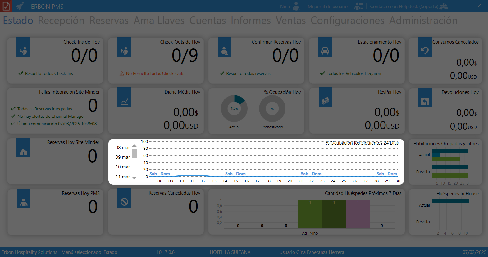

## **Panel principal (Dashboard)**

Es una pantalla central en el módulo de eventos del sistema Erbon PMS que proporciona un resumen completo y en tiempo real de todas las actividades relacionadas con eventos. Este panel permite al equipo del hotel gestionar y monitorizar los eventos del día y los próximos días, facilitando una administración eficiente y una mejor experiencia para los participantes.

### **Sección de Check-Ins y Check-Outs**
- **Check-Ins de hoy**: Indica cuántos check-ins están programados y cuántos se han realizado.

- **Check-Outs de hoy**: Indica cuántos huéspedes deben salir hoy y cuántos han realizado el check-out.

- **Confirmar reservas hoy**: Número de reservas que deben confirmarse hoy.

### **Sección de integración y reservas**
- **Fallas integración Site Minder**: Indica si hay errores en la integración con el gestor de reservas.

- **Reservas Hoy Site Minder**: Cantidad de reservas recibidas desde Site Minder, una plataforma de administración de reservas.

- **Reservas Hoy PMS**: Cantidad de reservas gestionadas directamente en el sistema PMS.

- **Reservas Canceladas Hoy**: Número de cancelaciones registradas en el día.

### **Métricas financieras**
- **Diaria Media Hoy**: Promedio de ingresos por habitación en el día.

- **RevPar Hoy**: Ingreso por habitación disponible.

- **Consumos Cancelados**: Cancelaciones de productos o servicios consumidos por los huéspedes.

- **Devoluciones Hoy**: Cantidad de dinero reembolsado a los huéspedes.

### **Ocupación del Hotel**
- **% Ocupación Hoy**: Ocupación real del hotel en el día.

<!-- - **Pronosticado**: Ocupación esperada según reservas futuras. -->
- **Huespedes In house**: Es el número real de huéspedes en el hotel.

- **% Ocupación los Siguientes 24 Días**: Gráfica de ocupación proyectada.

- **Habitaciones Ocupadas y Libres**: Comparación de habitaciones ocupadas vs. disponibilidad.

- **Cantidad Huéspedes Próximos 7 Días**: Estadísticas de huéspedes esperados.

## **Pie de página**

- **Erbon Hospitality Solutions** (Empresa que desarrolla el software).
- **Menú seleccionado: Estado** (Sección activa en el sistema).
- **Versión del sistema: 10.17.0.6**.
- **Hotel: HOTEL LA SULTANA** (Nombre del hotel que usa el software).
- **Usuario: Gina Esperanza Herrera** (Usuario logueado en el sistema).
- **Fecha actual: 07/03/2025**.

<!-- ## **¿Por qué es importante el Dashboard de Eventos?**
1. **Eficiencia operativa**: Simplifica la gestión de eventos al centralizar toda la información clave.
2. **Planificación anticipada**: Permite al equipo del hotel prepararse para los próximos días, asegurando que todo esté en orden.
3. **Seguimiento en tiempo real**: Ofrece una visión completa de los eventos actuales y de las actividades relacionadas con los participantes. -->