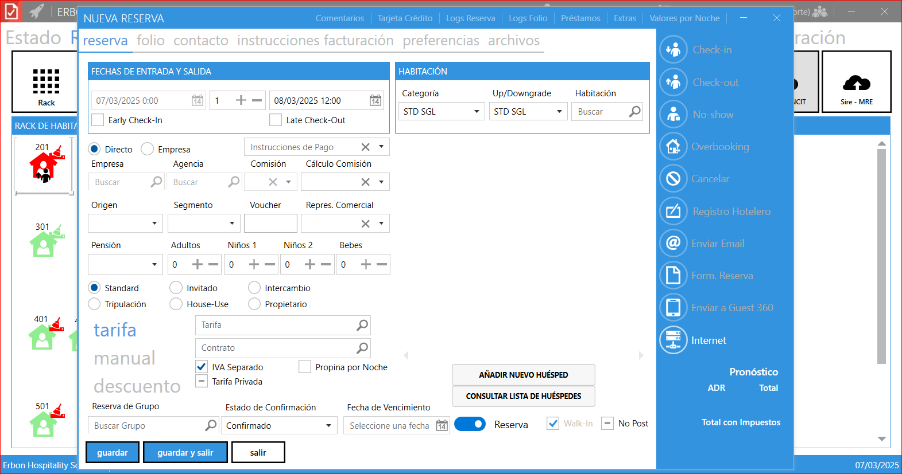

# **Incluir walk-in**

En el contexto de los sistemas de gestión hotelera (PMS, por sus siglas en inglés), el término "walk-in" se refiere a huéspedes que llegan al hotel sin una reserva previa. Por lo tanto, la función **Incluir Walk-in** en el menú de Erbon PMS está diseñada para gestionar de manera eficiente este tipo de situaciones, permitiendo al personal del hotel registrar y asignar habitaciones a estos huéspedes de forma rápida y organizada.

## **Campos y descripción**  

### **1. Datos Generales**  
- **Check-in:** Fecha de llegada de la reserva.  
- **Noches:** Cantidad de noches que abarca la reserva.  
- **Check-out:** Fecha de salida de la reserva.  
- **Directo:** Indica si la reserva fue realizada directamente por el huésped.  
- **Empresa:** Indica si la reserva fue realizada por una empresa o agencia.  

### **2. Información sobre la Empresa o Agencia**  
- **Empresa:** Si la reserva fue realizada por una empresa, haga clic en la lupa, busque la empresa registrada y haga doble clic sobre el registro correspondiente.  
- **Agencia:** Si la reserva fue realizada por una agencia, siga el mismo procedimiento que con la empresa: haga clic en la lupa, busque la agencia registrada y seleccione la opción deseada.  
- **Comisión:** Si la agencia tiene comisiones registradas, seleccione la comisión que será aplicada a esta reserva.  
- **Cálculo de Comisión:** Método de cálculo de la comisión aplicada a la reserva.  

### **3. Detalles de la Reserva**  
- **Origen:** Origen de la reserva.  
- **Segmento:** Segmento al que pertenece la reserva.  
- **Voucher:** Número del voucher si aplica.  
- **Representante Comercial:** Nombre del representante comercial a cargo.  

### **4. Tipo de Pensión y Ocupación**  
- **Tipo de Pensión:** Tipo de pensión seleccionada para la reserva.  
- **Adultos:** Número de adultos incluidos en la reserva.  
- **Niños:** Número de niños en la reserva.  
- **Bebés:** Número de bebés en la reserva.  

### **5. Clasificación de la Reserva**  
- **Estándar:** Reserva normal que genera transacciones financieras.  
- **Uso de la Casa:** Reserva interna que no genera transacciones financieras.  
- **Permuta:** Reserva de intercambio sin costo financiero.  
- **Cortesía:** Reserva de cortesía sin cargo.  
- **Propietario:** Indica que el propietario de la unidad habitacional (UH) se hospedará sin generar cobros automáticos.  
- **Tripulante:** Indica que un empleado del aeropuerto se hospedará, generando una transacción financiera.  

### **6. Tarifas y Descuentos**  
- **Tarifa:** Haga clic en la lupa y seleccione la tarifa correspondiente al período de la reserva.  
- **Manual:** Permite ingresar manualmente el precio de cada noche.  
- **Descuento:** Especifica el valor del descuento aplicado por noche.  

### **7. Asociación y Confirmación**  
- **Pertenencia a Grupo:** Haga clic en la lupa para seleccionar un grupo registrado al que pertenezca la reserva.  
- **Confirmación de la Reserva:** Estado de la reserva (confirmada o en proceso de confirmación).  
- **Vencimiento:** Fecha límite para la confirmación de la reserva.  
- **Reserva:** Define si se trata de una reserva definitiva o una pre-reserva.  

### **8. Datos de la Unidad Habitacional (UH)**  
- **Reserva en el Mostrador (Walk-in):** Indica si la reserva fue realizada en el mostrador.  
- **Tipo de UH Reservada:** Seleccione el tipo de unidad habitacional reservada.  
- **Tipo de UH Ocupada:** Seleccione el tipo de unidad habitacional ocupada.  
- **UH Disponible:** Haga clic en la lupa para buscar y seleccionar una unidad habitacional disponible.  

### **9. Gestión de Huéspedes**  
- **Incluir Nuevo Huésped:** Abre la pantalla para registrar un nuevo huésped.  
- **Consultar Lista de Huéspedes:** Permite consultar la lista de huéspedes registrados para su selección.